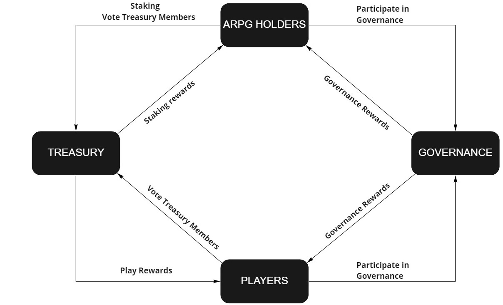

# Token: $ARPG

Atheos RPG (**$ARPG**) is a governance token with limited supply of **100,000,000 Tokens**.  

$ARPG tokens bind the Atheos ecosystem together, blurring the lines between investors, players and developers by pooling power, responsibility, and aligning their incentives. 

Users that stake $ARPG will be able to determine the future of Atheos, and receive rewards while doing so. 

**$ARPG** tokens have three main use cases: 

 - **Staking:**  Staking $ARPG rewards users with newly minted tokens and a share of the game's revenue (Staking $ARPGs is required to participate in the governance mechanisms). 

 - **Governance:** We want to provide the Atheos community with an unprecedented opportunity to connect and interact in a constant open communication channel between developers, players and stakers. Users will be able to participate in a number of key votes that will determine the future of Atheos. 	

 - **Microtransactions:**  Users will be able to buy cosmetic items directly from the store.  There will be cosmetic items for characters, sanctuaries, enclaves and more. Limited cosmetic items will be released periodically.

