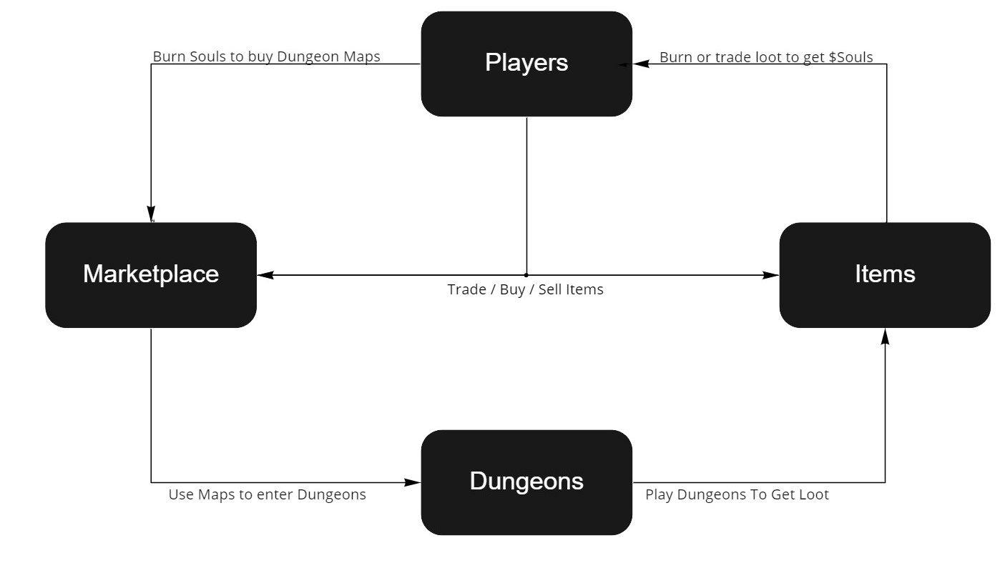

 
# Token: $Souls

Atheos **in-game currency** with **unlimited supply.**  

The purpuse of $Souls coin is to maintain in-game balance for players to enjoy and experience the game.

Treasury will mint/burn tokens to maintain the in-game balance and the stability of its price. 
If a higher price hits, supply will increase to match the price balance and viceversa.

$Souls is an in-game token which **is not** meant to be used as means of speculation.   **$Souls is not an invesetment coin.**

#### **Acquiring $Souls**  
Players can earn $Souls by completing Quests, winning PvP matches, participating in events, and can find it organically as they explore dungeons and defeat enemies. 

Players can **Burn** the items in exchange for $Souls.  This process is done at the [Forge](https://atheosgame.github.io/game/commongrounds/the-forge/), which will destroy the item permanently. 

#### **Spending $Souls**   
Players will burn $Souls (destroyed) to buy [Dungeon Maps](https://atheosgame.github.io/game/gameplaymechanics/maps/) within the game.

The price of these maps will be proportionate to the level of the map. 
Higher-level maps provide more challenging experiences and will offer better loot rewards. 

*Once the game's economy has developed, players will be able to trade items in **Atheos Marketplace** using $Souls.*

#### Soul Events

Every time a player does an in-game transaction involving $Souls, **10% of the token's spent** will be transferred back to the [Treasury](https://atheosgame.github.io/tokenomics/treasury/) and into the **Soul Counter Reservoir (SCR)** , with the rest of the tokens being burned. 

 **Soul Counter Reservoir (SCR):**  
Soul Events will occur periodically, whenever the amount of tokens accumulated inside the SCR surpasses a certain treshold.  
The events will feature limited content, namely event enemies. Defeating event enemies will reward the players with an appropriate amount of **$SOULS** from the SCR and ranking points. Once the SCR reaches zero, the event will end and rankings will be published. 

The Treasury threshold will change after each successful event. If players complete the event too quickly, the threshold will increase, and vice-versa, ensuring that the duration of the event is proportionate with the player base. 

*The fee percentages, and the types of events will all be subject to the Treasury Governance.*
